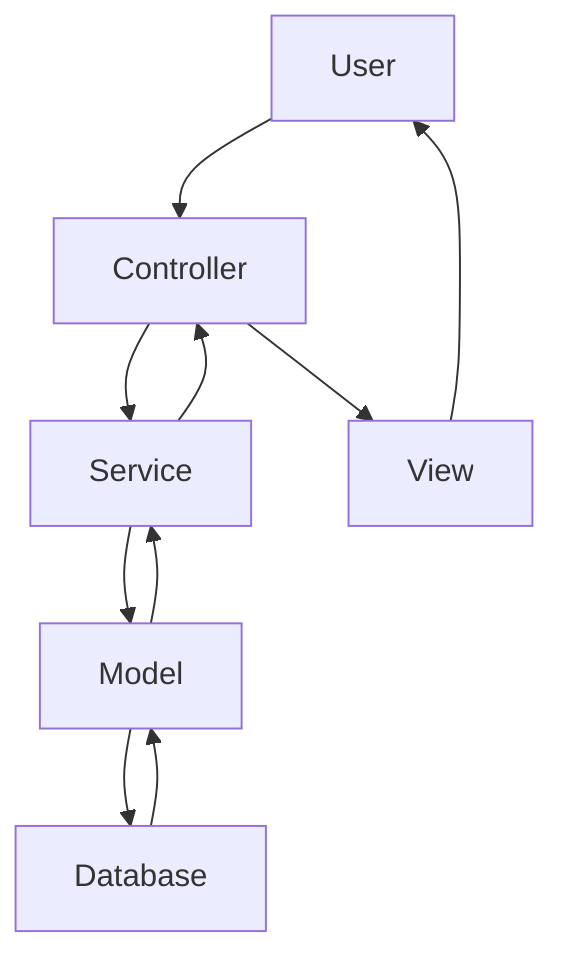
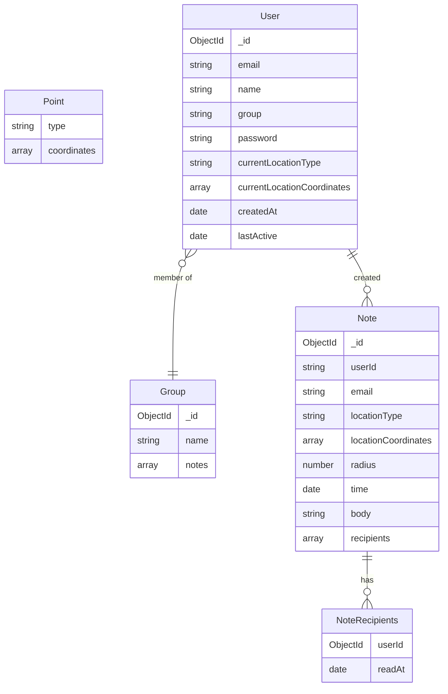

[Live Site](https://placenotes.onrender.com/users/login)

A loved one arrives at the imposing corporate tower where they are having thier interview, and gets a message:

"You've got this! You're not just qualified for this role; you're the perfect fit. Go in there and show them the incredible person I see every day. I'm so proud of you and I'm cheering you on all the way. 💖"

You arrive at Costco, and get a message:

" 2024.10.25 out of paper towel rolls

- [ ] eggs
- [ ] milk
- [ ] oatmeal
- [x] cheese got xl pack 10-15
- [ ] malbec wine "

It's your Costco shopping list, and it pops up when you arrive at Costco.

**Placenotes** is a powerful messaging and notetaking app that adds the element of location to your messages. It can be used as a notetaking app or a messaging app

Built with Express and Mongodb
This is a work in progress.

## Express server application

### RESTful API

The Placenotes server is a RESTful API build on Express that supports the following actions:

- POST users/login or users/signup
  - Directs user to login form
- POST users/login or users/signup

  - Creates a new user

- GET /users/all
  - Retrieves all users
- GET /users/:id
  - Retrieves the user with the specified id
  * alternate: GET /users?id=:id
- GET /users/:name
  - Retrieves the user with the specified name
  * alternate: GET /users?name=:name
- GET /users/email/:email
  - retrieves user with the specified email
  - alternate /users?email=:email
- GET /users/group/:group
  - retrieves user by the specified group
  - alternate /users?email=:email
- GET /users/:id/notes

  - Retrieves all notes for the user with the specified id

- GET /users/:id/time/:time

  - Retrieves all notes for the user at the specified time

  * alternate /users/:id/?time=:time

- GET /users/:id/notes/:id
  - Retrieved a single note wiht \_id ot noteId for the user with the specified \_id of userId
- PUT /users/:id/notes/:id
  - Updates a single note wiht \_id ot noteId for the user with the specified \_id of userId
- DELETE /users/:id/notes/:id

  - Deletes a single note for the user with the specified id

- GET /notes
  - Retrieves all notes for the logged in user
- GET /notes/:id

  - Retrieves the note with the specified id

- GET /notes/time/:time
  - Retrieces note created by the logged in user and the specified time
- PUT /notes//time/:time
  - Updates note created by the logged in user and the specified time
- DELETE /notes/time/:time

  - Deletes note created by the logged in user and the specified time

- GET /notes/location/:lat/:lon
  - Retrieves notes created at the specified latitude and longitude

### Template Engine and Middleware

- A _template engine_ renders views with Express
- EJS renders UI components. It modularizes components such as the drawer UI, to keep DRY

- The application runs the following **middleware**:
  - `autoLogin`: checks if a user is logged in and if not attempts to log them in using a cookie if present
  - `setUser`: sets the user on the request object if the user is logged in.
  - `passport.js`: Provides authentication services. Future development will include Google OAuth.

## MongoDB Database

- The API and MongoDB database supports full CRUD Operations

## MVC Architecture

- The app uses the Model View Controller (MVC) architecture to separate concerns between the database, user interface, and application logic. This allows for easier maintenance and scalability of the application.

- **Model**: defines the data layer of the application, which includes the database schema and any operations that interact with the database. This layer is responsible for retrieving and storing data in the database.
- **View**: defines the user interface layer of the application, which includes the templates and static assets. This layer is responsible for rendering the user interface and any static assets.
- **Controller**: defines the application logic layer of the application, which includes the API endpoints and any operations that interact with the View. It calls the service layer to perform business logic.
  - The **Routes** defines API end points and maps them to controller functions.
- **Service Layer**: Here is the business logic of the application. It interacts with the models to perform database operations.

- This organization practices my **clean coding** skills and supports development of my application

## How To Run

1. `npm install` to install all dependencies
2. `npm run seed` to seed the database with sample data
3. `npm run dev` to start the server in development mode
4. Open a web browser and navigate to `localhost:3000` to access the app

## Todo

- [ ] realtime communication library
- [ ] Redux for state for real time updates

  2024.11.01
- [x] one file does one thing

# SBA 319

|                                                                                                                                                                                                                                                                                                                                                                                                                                  |        |
| -------------------------------------------------------------------------------------------------------------------------------------------------------------------------------------------------------------------------------------------------------------------------------------------------------------------------------------------------------------------------------------------------------------------------------- | ------ |
| Requirement                                                                                                                                                                                                                                                                                                                                                                                                                      | Weight |
| Use at least three different data collections within the database (such as users, posts, or comments).                                                                                                                                                                                                                                                                                                                           | 5%     |
| Utilize reasonable data modeling practices.                                                                                                                                                                                                                                                                                                                                                                                      | 10%    |
| Create GET routes for all data that should be exposed to the client, using appropriate query commands to retrieve the data from the database.                                                                                                                                                                                                                                                                                    | 10%    |
| Create POST routes for data, as appropriate, using appropriate insertion commands to add data to the database. At least one data collection should allow for client creation via a POST request.                                                                                                                                                                                                                                 | 10%    |
| Create PATCH or PUT routes for data, as appropriate, using appropriate update commands to change data in the database. At least one data collection should allow for client manipulation via a PATCH or PUT request.                                                                                                                                                                                                             | 10%    |
| Create DELETE routes for data, as appropriate, using appropriate delete commands to remove data from the database. At least one data collection should allow for client deletion via a DELETE request.                                                                                                                                                                                                                           | 10%    |
| Include sensible indexes for any and all fields that are queried frequently. For fields that may have a high write-to-read ratio, you may forgo indexes for performance considerations. Make comments of this where applicable.                                                                                                                                                                                                  | 5%     |
| Include sensible MongoDB data validation rules for at least one data collection.   Note: this may be accomplished in a number of ways. If you choose to perform this task outside of your application's code, you must include a way to test the validation within the application's routes. This can be as simple as providing a POST route that attempts to create an invalid document and displays the resulting error. | 5%     |
| Populate your application's collections with sample data illustrating the use case of the collections. You must include at least five sample documents per collection.   Note: Double-check this requirement before submission. Testing your delete routes may leave you under the requirement. To be safe, populate your collections with sample data well above the requirement (we recommend 10-20 documents).          | 5%     |
| Utilize reasonable code organization practices.                                                                                                                                                                                                                                                                                                                                                                                  | 5%     |
| Ensure that the program runs without errors (comment out things that do not work, and explain your blockers - you can still receive partial credit).                                                                                                                                                                                                                                                                             | 10%    |
| Commit frequently to the git repository.                                                                                                                                                                                                                                                                                                                                                                                         | 5%     |
| Include a README file that contains a description of your application.   This README must include a description of your API's available routes and their corresponding CRUD operations for reference.                                                                                                                                                                                                                      | 5%     |
| Level of effort displayed in creativity and user experience.                                                                                                                                                                                                                                                                                                                                                                     | 5%     |

Bonus Objectives The objectives listed here are not required. Ensure that your application meets the requirements above before attempting to further expand your features. These bonus objectives cannot increase your overall score above 100%. Successful completion of these objectives can; however, make up for lost points above. Ensure your application works as outlined by the requirements above before attempting these objectives, time permitting.

Use Mongoose to implement your application.

Note: The validation requirements above must still be implemented database-side, but should also be implemented application-side within your Mongoose schema(s).
