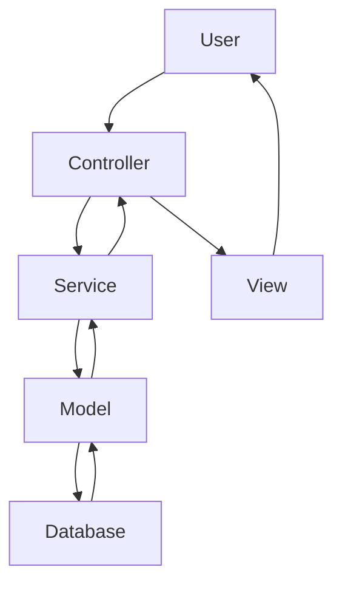
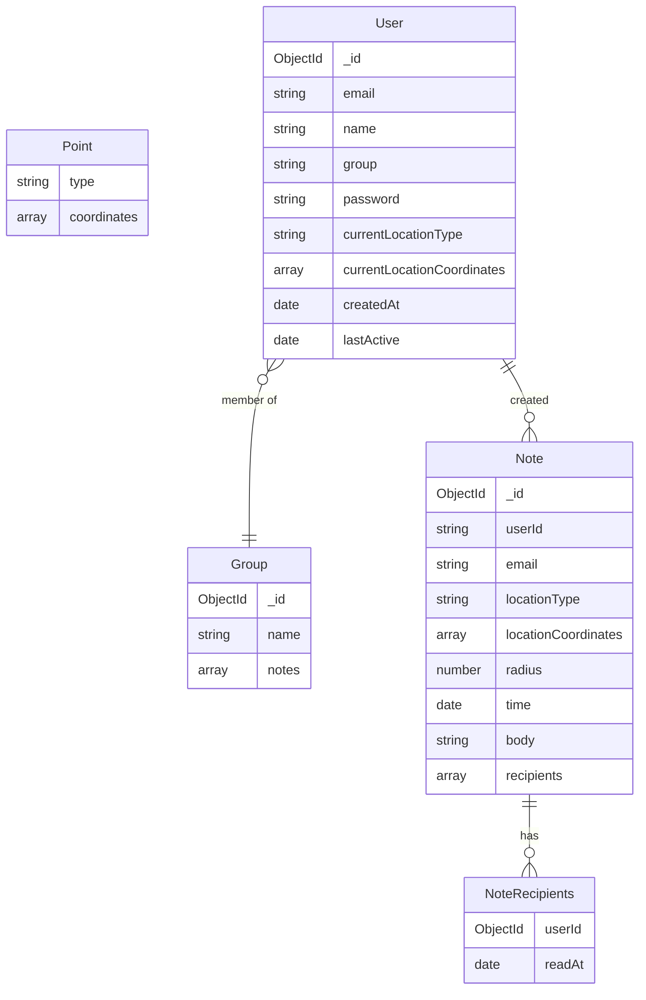

Imagine this:

Your daughter is about to walk into her dream job interview at a towering office building in downtown Seattle. As she approaches the entrance, her phone buzzes with a note you left just for this moment:

"You've got this, sweetheart! You're not just qualified for this role; you're the perfect fit. Remember how you led that project at your last job? That's exactly what they're looking for. Take a deep breath, stand tall, and show them the incredible person I see every day. I'm so proud of you! 💖 - Lilly"

---

Later that day, you pull into Costco's parking lot, and Placenotes automatically surfaces your family's shared shopping list:

"📝 Family Costco Run (last updated: 2 hours ago)
- [ ] Eggs (the 24-pack was on sale!)
- [ ] Milk (both regular and almond)
- [ ] Steel-cut oatmeal
- [x] Sharp cheddar (got the big pack, we're set for the month!)
- [ ] That Malbec wine Dad loves
- [ ] Paper towels (we're almost out!)
Note from Sarah: Don't forget to use the new membership card!"

You'll have access to the information you need to remember, right when you arrive. 

This is Placenotes - your messages and notes, exactly where and when you need them.

**Placenotes** is a powerful location-aware messaging and note-taking platform that brings context to your communications. By combining the convenience of messaging with location intelligence, it helps you share the right information at the right place and time.

### Key Features

 **Location-Aware Messages**
- Messages appear when you arrive at specific locations
- Set custom radius for message triggers
- Perfect for location-specific reminders and notes

 **Smart Note-Taking**
- Full Markdown support for rich formatting
- Organize notes by location and time
- Search and filter notes easily
- Throughfully designed UI- Quickly scroll through your messages. Expand and collase them right where you were reading. 

 **Social Features**
- Share notes with specific friends
- Send location-based messages to loved ones
- Find and connect with friends
- Real-time updates

 **Privacy & Security**
- Control over location sharing
- Private and shared note options
- Secure authentication system

Built with Express and MongoDB, featuring both GraphQL and REST APIs.

## Express server application

### The GraphQL API

The Placenotes server leverages GraphQL for its API, offering several advantages:

1. Flexible data fetching: Clients can request exactly the data they need, reducing over-fetching and under-fetching.
2. Strongly typed schema: Provides clear contract between client and server, enhancing development efficiency.
3. Single endpoint: Simplifies API management and reduces network overhead.
4. Real-time updates: Facilitates subscription-based features for live data.
5. Introspection: Allows for self-documenting APIs, improving developer experience.

These benefits make GraphQL an ideal choice for Placenotes' complex, interconnected data model and real-time features.

### The REST API

The Placenotes server is a RESTful API build on Express that supports the following actions:

- POST users/login or users/signup
  - Directs user to login form
- POST users/login or users/signup

  - Creates a new user

- GET /users/all
  - Retrieves all users
- GET /users/:id
  - Retrieves the user with the specified id
  * alternate: GET /users?id=:id
- GET /users/:name
  - Retrieves the user with the specified name
  * alternate: GET /users?name=:name
- GET /users/email/:email
  - retrieves user with the specified email
  - alternate /users?email=:email
- GET /users/group/:group
  - retrieves user by the specified group
  - alternate /users?email=:email
- GET /users/:id/notes

  - Retrieves all notes for the user with the specified id

- GET /users/:id/time/:time

  - Retrieves all notes for the user at the specified time

  * alternate /users/:id/?time=:time

- GET /users/:id/notes/:id
  - Retrieved a single note wiht \_id ot noteId for the user with the specified \_id of userId
- PUT /users/:id/notes/:id
  - Updates a single note wiht \_id ot noteId for the user with the specified \_id of userId
- DELETE /users/:id/notes/:id

  - Deletes a single note for the user with the specified id

- GET /notes
  - Retrieves all notes for the logged in user
- GET /notes/:id

  - Retrieves the note with the specified id

- GET /notes/time/:time
  - Retrieces note created by the logged in user and the specified time
- PUT /notes//time/:time
  - Updates note created by the logged in user and the specified time
- DELETE /notes/time/:time

  - Deletes note created by the logged in user and the specified time

- GET /notes/location/:lat/:lon
  - Retrieves notes created at the specified latitude and longitude

### Middleware

- The application runs the following **middleware**:
  - `autoLogin`: checks if a user is logged in and if not attempts to log them in using a cookie if present
  - `setUser`: sets the user on the request object if the user is logged in.
  - `passport.js`: Provides authentication services. Future development will include Google OAuth.
### Client
- React client is built using Vite and React Router.
## System Design

- The app uses the Model View Controller (MVC) architecture to separate concerns between the database, user interface, and application logic. This allows for easier maintenance and scalability of the application.

- **Model**: defines the data layer of the application, which includes the database schema and any operations that interact with the database. This layer is responsible for retrieving and storing data in the database.
- **View**: defines the user interface layer of the application, which includes the templates and static assets. This layer is responsible for rendering the user interface and any static assets.
- **Controller**: defines the application logic layer of the application, which includes the API endpoints and any operations that interact with the View. It calls the service layer to perform business logic.
  - The **Routes** defines API end points and maps them to controller functions.
- **Service Layer**: Here is the business logic of the application. It interacts with the models to perform database operations.

- This organization practices my **clean coding** skills and supports development of my application

## Database Schema

## How To Run

1. `npm install` to install all dependencies
2. `npm run seed` to seed the database with sample data
3. `npm start` to start the server and client  in development mode
4. Open a web browser and navigate to `localhost:5173` to access the app

## Todo

- [ ] realtime communication library
- [ ] Redux for state for real time updates

  2024.11.01
- [x] one file does one thing
